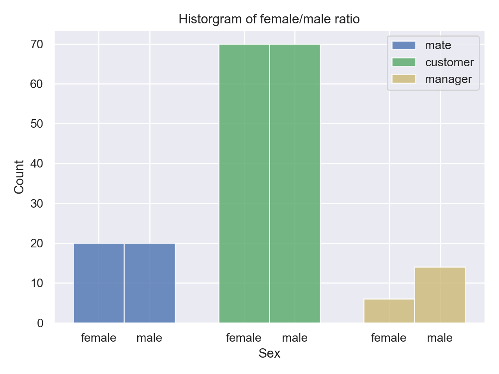
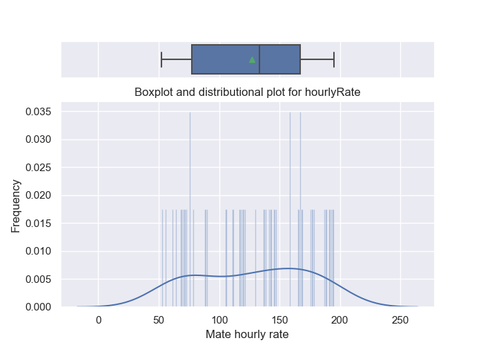
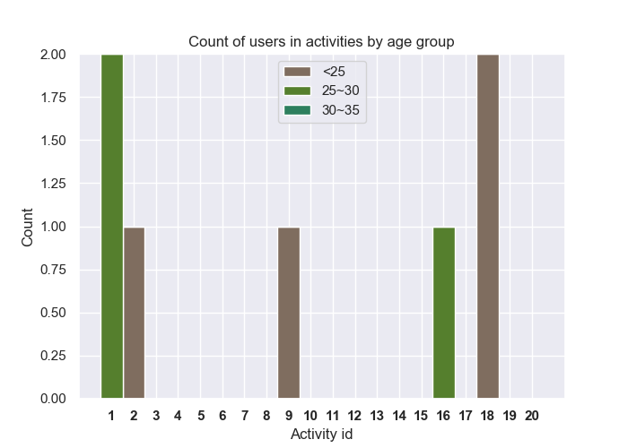
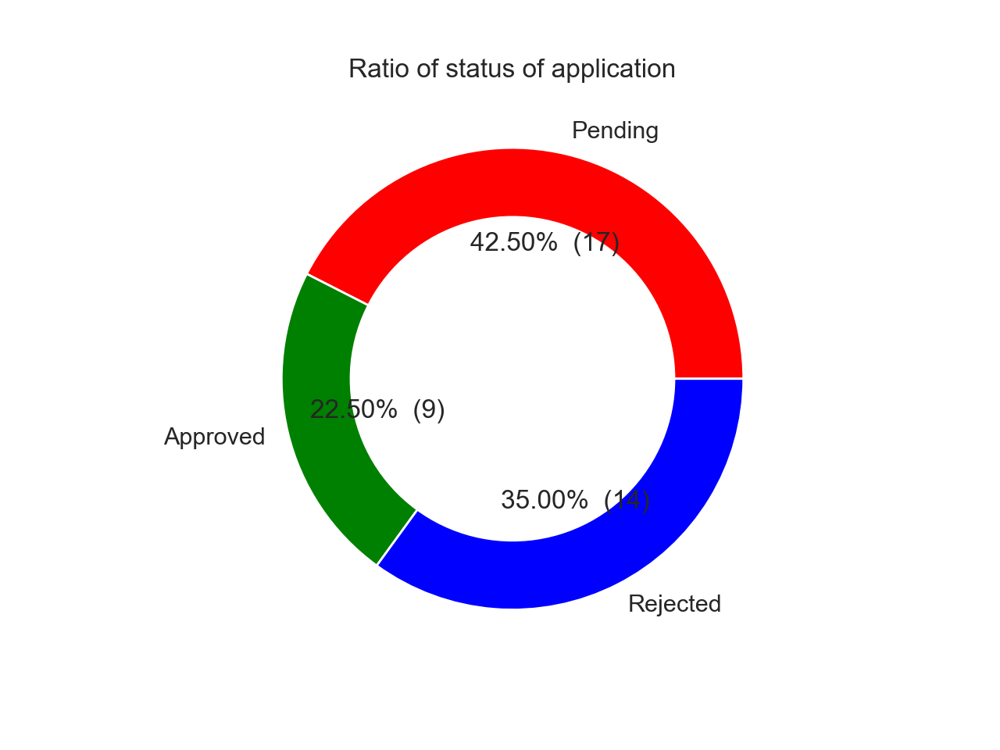

[](https://shields.io/)
[](https://shields.io/)
[](https://shields.io/)
[](https://shields.io/)


# COMP421_Database_Project: Boyfriend/girlfriend rental system

Creation from scratch of an database from scratch for a real world application. Step by step, you will design a schema, create a database using DB2/PostgreSQL, populate your database with data, maintain, query and update your data, develop application programs, and implement a user-friendly interface.

## Description 
- The purpose of this application is to introduce a dating system different to any others: a date rental service. Instead of putting time and effort in looking for a date, in which some cases people are not willing or feel unable to put in, we want to offer them the possibility of renting a suitable dating partner with certain desired characteristics. Consider for instance, an event in which going alone would be rather awkward; rent a date of your liking instead! Sometimes people feel lonely and would simply like some companies to do their preferred activities: walking around a park, going to a restaurant or a cinema, talk at a café, etc. We propose an interactive platform in which people can do this easily. 

## Overleaf Project/ Writeup 
- See the file `Requirement_Analysis.pdf` under this main directory. 

## Connection instructions: 

Server information:  
- host: `comp421.cs.mcgill.ca`
- Linux account name: `cs421g88` 
- password: `<our group's password>`

ex. connection:  
`ssh comp421.mcgill.ca -l cs421g88`  

`password: ********`

`cs421g88@comp421 ~ $bash`

Database information: 
- Once inside the server, connect to `postgresql` as follows: 

`psql cs421` 

`password: <same_as_above>` 

## Database creation: 

- Please run the following creation (SQL) scriptsin the following order: 

    1. `table_creation.sql`
    2. `1_usertable_insertions.sql` 
    3. `2_mate_insertions.sql` 
    4. `3_customer_insertions.sql` 
    5. `4_manager_insertions.sql`
    6. `5_application_insertions.sql` 
    7. `6_request_insertions.sql`
    8. `7_order_insertions.sql` 
    9. `8_invoice_insertions.sql` 
    10. `9_startTable_insertions.sql`
    11. `10_activity_insertions.sql` 
    12. `11_modify_insertions.sql` 
    13. `12_generate_insertions.sql` 
    14. `13_schedule_insertions.sql`

where the first script is in `scripts/database_creation/` and the rest are in `scripts/table_insertions/` . 
Script 1 is was randomly generated, subsequent table creation scripts were generated using the `table_insertions_script.py` script.

## ER-diagram 


## User-interface 
- The relevant files are located under the `user_interface` directory. Files descriptions can be found in the respective README.md
- Currently, application will only be emulated locally, but the intention is that it will eventually be available online as well. For this reason, HTML scripts are also placed as well. 


## Visualizations 

  1. *Visualization_1*:  Distribution of Male/Female current Users for Customers, Mates and Managers  
  Rationale: the distribution graph reveal about important info on sex, which might helps finding the target users, and for 
  advertisement purpose.
  
  

  2. *Visualization_2*:  Pairplot and distributions of ages vs. hourly rates for Mates
  Rationale: the pair plot provide the relateness between age and hourly rate, which contributes in finding target user since people
  tends to find similar age friends
  
  

  3. *Visualization_3*: Box/Distributional plot of the hourlyRate, mean value/Outliers
  Rationale：This combination of plots helps the company to monitor the hourly pay. (not overprice) Also, check those outliers to
  identify the popular ones or abnormal one.
  
  

  - Stacked Histogram for age interval and activites. The compnay might be instersted in investigating for a certain
  age interval, which activities is the most popular. This can help the company to form a better recommendations schema for website. 
  Age interval :  1)20-25 2) 25-30 3) 30-35
  
  

  - Donut Plot of statues for applications: Pending, Approved, Rejected, which helps to monitor managers’ workload.
  
  

### Demo (Creating a new user, logging-in ) 

```
cd COMP421_Database_Project\user_interface 
python main.py 

######################################################
Welcome to the MateRental database!
######################################################

Please choose one of the available options below:
         1. Log-in
         2. Register
         3. Administrator Connection
         4. Visualizations menu
         5. Exit

2
Register:
Please input username: newusername
Please enter your email: newuser@gmail/com
Please input password with 1) 1 Uppercase 2) 1 lowercase 3) at least 8 characters:

First name: User
Lasname: Name
Sex:
1. Male
2. Female
1
City: Usercity
Please input your phone number with no spaces or special characters5417894329
Date of birth:
year (YYYY): 1996
month (MM): 10
day (DD): 01
*****************************SQL*****************************
INSERT INTO usertable (username, password, email , firstname, lastname, sex, city , phoneNum, dateOfBirth) VALUES ('newusername', '5467354477', 'newuser@gmail/com', 'User', 'Name', 'Male', 'Usercity', 5417894329, '1996-10-01') ;
*************************MESSAGES****************************
INSERT 0 1
*****************************SQL*****************************
SELECT * FROM usertable WHERE username='newusername' ;

***************************OUTPUT****************************
      username    password              email firstname lastname   sex      city    phonenum dateofbirth
0  newusername  5467354477  newuser@gmail/com      User     Name  Male  Usercity  5417894329  1996-10-01
*************************MESSAGES****************************
SELECT 1
--INFO-- : User succesfully created! You can now log-in.
      username    password              email firstname lastname   sex      city    phonenum dateofbirth
0  newusername  5467354477  newuser@gmail/com      User     Name  Male  Usercity  5417894329  1996-10-01
###############################################################
                   New User Registration
###############################################################
I want to register as a ...
1. Customer2. Mate
1
Please write your preferences: (max 1000 characters)I want a sandwich!!!
*****************************SQL*****************************
INSERT INTO customer (username, preferences) VALUES ('newusername','I want a sandwich!!! ')
;
*************************MESSAGES****************************
INSERT 0 1
Thank you! You can now log-in in the main menu

######################################################
Welcome to the MateRental database!
######################################################

Please choose one of the available options below:
         1. Log-in
         2. Register
         3. Administrator Connection
         4. Visualizations menu
         5. Exit

5
~Goodbye~

```
### Demo (Customer: search mates, see my orders, make change to orders, make change to preference)

```
######################################################
                  Customer Options Menu
######################################################

Please choose one of the available options below:
         1. See Mates
         2. See my orders
         3. Pay Invoice
         4. Update preferences
         5. Exit

1
######################################################
                    Look for a Mate
######################################################
1. See all mates
2. Custom search
3. Exit

1
**Order by**
1.Hourly Rate
2.Age
3.Nickname
4.None
1
*****************************SQL*****************************
SELECT nickname,
         description
        , sex,
         language,
         height,
         weight,
         hourlyrate
FROM mate m
JOIN usertable u
         ON m.username = u.username
ORDER BY hourlyrate
;

***************************OUTPUT****************************
      nickname    description     sex      language height weight hourlyrate
0   nickname34  description34  Female       English   1.76  74.00         52
1    nickname4   description4    Male  Eng & French   1.61  65.00         56
2   nickname14  description14    Male        French   1.79  69.00         61
3   nickname22  description22  Female  Eng & French   1.61  61.00         64
4   nickname19  description19    Male  Eng & French   1.85  69.00         68
5   nickname15  description15    Male  Eng & French   1.83  70.00         70
6    nickname2   description2    Male       English   1.84  73.00         72
7    nickname3   description3    Male       English   1.80  56.00         73
8    nickname9   description9    Male        French   1.61  70.00         76
9    nickname1   description1    Male        French   1.62  58.00         76
10  nickname31  description31  Female        French   1.55  56.00         78
11   nickname8   description8    Male  Eng & French   1.85  62.00         89
12   nickname7   description7    Male  Eng & French   1.90  55.00         90
13  nickname29  description29  Female  Eng & French   1.95  63.00        106
14  nickname20  description20  Female  Eng & French   1.80  58.00        112
15  nickname38  description38  Female  Eng & French   1.50  69.00        117
16  nickname18  description18    Male        French   1.58  62.00        118
17   nickname0   description0    Male        French   1.82  56.00        120
18   nickname6   description6    Male       English   1.71  64.00        121
19  nickname23  description23  Female       English   1.61  56.00        130
20  nickname36  description36  Female  Eng & French   1.88  70.00        137
21  nickname10  description10    Male  Eng & French   1.55  57.00        138
22  nickname13  description13    Male       English   1.54  61.00        142
23  nickname17  description17    Male  Eng & French   1.64  68.00        143
24  nickname12  description12    Male       English   1.77  74.00        146
25  nickname16  description16    Male  Eng & French   1.93  72.00        147
26  nickname32  description32  Female  Eng & French   1.58  58.00        158
27  nickname28  description28  Female  Eng & French   1.77  70.00        159
28  nickname37  description37  Female  Eng & French   1.56  64.00        166
29  nickname26  description26  Female       English   1.70  73.00        167
30  nickname11  description11    Male       English   1.80  71.00        167
31  nickname33  description33  Female       English   1.80  63.00        169
32  nickname30  description30  Female       English   2.00  58.00        176
33  nickname25  description25  Female  Eng & French   1.94  61.00        177
34  nickname39  description39  Female  Eng & French   1.99  70.00        179
35  nickname35  description35  Female  Eng & French   1.84  57.00        187
36   nickname5   description5    Male        French   1.78  69.00        189
37  nickname21  description21  Female        French   1.58  63.00        192
38  nickname27  description27  Female        French   1.57  58.00        193
39  nickname24  description24  Female       English   1.70  56.00        195
*************************MESSAGES****************************
SELECT 40

######################################################
                    Look for a Mate
######################################################
1. See all mates
2. Custom search
3. Exit

3
Exit

######################################################
                  Customer Options Menu
######################################################

Please choose one of the available options below:
         1. See Mates
         2. See my orders
         3. Pay Invoice
         4. Update preferences
         5. Exit

2
*****************************SQL*****************************
SELECT * FROM orderTable WHERE rid IN (SELECT rid FROM request WHERE custname = 'agiven2o');
***************************OUTPUT****************************
   oid   startdate ordstatus  rid  ratingdate    comment rating
0    6  2018-11-08   pending   30  2019-03-27  comments6    4.8
*************************MESSAGES****************************
SELECT 1
To continue:

1. Make change to an order

2. Go back

1
Please enter the order number

6
*****************************SQL*****************************
SELECT * FROM orderTable WHERE oid = 6;
***************************OUTPUT****************************
   oid   startdate ordstatus  rid  ratingdate    comment rating
0    6  2018-11-08   pending   30  2019-03-27  comments6    4.8
*************************MESSAGES****************************
SELECT 1
*****************************SQL*****************************
(SELECT * FROM request WHERE rid = 30);
***************************OUTPUT****************************
   rid          rinfo   rstatus  custname   matename       rdate     decdate
0   30  Information63  accepted  agiven2o  tstobbs2x  2018-07-06  2018-10-21
*************************MESSAGES****************************
SELECT 1
Would you like to

1. Cancel this order

2. Rate this order

3. Go back

1
*****************************SQL*****************************
UPDATE orderTable SET ordStatus = 'complete' WHERE oid = 6;
*************************MESSAGES****************************
UPDATE 1
Order cancelled
Would you like to

1. Cancel this order

2. Rate this order

3. Go back

2
*****************************SQL*****************************
SELECT * FROM orderTable WHERE oid = 6;
***************************OUTPUT****************************
   oid   startdate ordstatus  rid  ratingdate    comment rating
0    6  2018-11-08  complete   30  2019-03-27  comments6    4.8
*************************MESSAGES****************************
SELECT 1
From 1-5, how would you like to rate this order?

4
*****************************SQL*****************************
UPDATE orderTable SET rating = 4 WHERE oid = 6;
*************************MESSAGES****************************
UPDATE 1
Please leave your comment.

good
*****************************SQL*****************************
UPDATE orderTable SET comment = 'good ' WHERE oid = 6;
*************************MESSAGES****************************
UPDATE 1
*****************************SQL*****************************
UPDATE orderTable SET ratingDate = '2020-04-11' WHERE oid = 6;
*************************MESSAGES****************************
UPDATE 1
*****************************SQL*****************************
SELECT * FROM orderTable WHERE rid IN (SELECT rid FROM request WHERE custname = 'agiven2o');
***************************OUTPUT****************************
   oid   startdate ordstatus  rid  ratingdate comment rating
0    6  2018-11-08  complete   30  2020-04-11   good     4.0
*************************MESSAGES****************************
SELECT 1
To continue:

1. Make change to an order

2. Go back

2

######################################################
                  Customer Options Menu
######################################################

Please choose one of the available options below:
         1. See Mates
         2. See my orders
         3. Pay Invoice
         4. Update preferences
         5. Exit

4
*****************************SQL*****************************
SELECT * FROM customer WHERE username = 'agiven2o'
***************************OUTPUT****************************
   username   preferences
0  agiven2o  preference66
*************************MESSAGES****************************
SELECT 1
Your current preference is
 "preference66"
please enter your new preference
movie, talk, cooking, dance
*****************************SQL*****************************
UPDATE customer SET preferences = 'movie, talk, cooking, dance' WHERE username = 'agiven2o';
*************************MESSAGES****************************
UPDATE 1
Preference editted successfully

######################################################
                  Customer Options Menu
######################################################

Please choose one of the available options below:
         1. See Mates
         2. See my orders
         3. Pay Invoice
         4. Update preferences
         5. Exit

5
Exit
```
